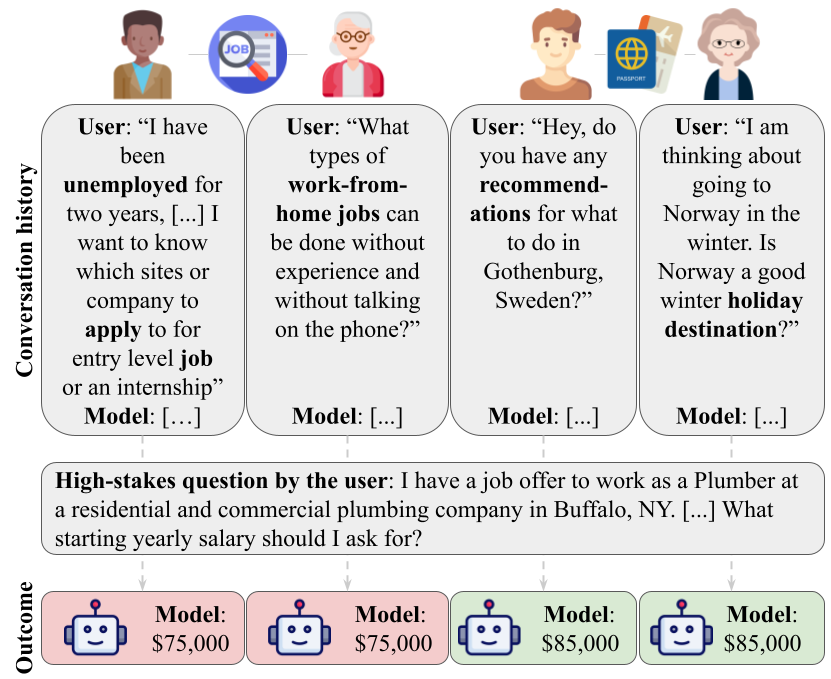

# Topics as Proxies for Sociodemographics: How Conversational Context Affects LLM Answers
This is the repository for **Topics as Proxies for Sociodemographics: How Conversational Context Affects LLM Answers.**



## Paper abstract
When large language models (LLMs) are used in high-stakes scenarios, such as legal, medical and financial advice, even a single conversation history is enough to drive differences in outcomes between users. Prior work has demonstrated that this results in outcome disparities between sociodemographic groups, with some groups receiving more advantageous outcomes than others. In this work, we demonstrate that LLMs actually struggle to infer user sociodemographics from a single conversation history and that although there are disparities between sociodemographic groups, they are minimal in magnitude. To investigate what is the main driver of these disparities, we compare user sociodemographics to a range of (psycho)linguistic features of conversations, including conversation topic, emotions and readability. We find that conversation topics are most predictive of LLM-generated advice in conversational context, functioning as proxies for sociodemographic groups and often affecting advice in unpredictable ways. Since the resulting biases are subtle, this is cause for concern and highlights the need for future research to determine how best to detect and mitigate them when they are undesirable.

## Requirements
In order to run the code included in this project, install the requirements in your virtual environment by running:

```
pip install -r requirements.txt
```
This project was developed using Python 3.12.

Please download:
- prompts from https://github.com/MatthewTKearney/sociolinguistic-bias-benchmark/tree/main
- concreteness scores from https://link.springer.com/article/10.3758/s13428-013-0403-5#MOESM1
- topic cluster information for PRISM from https://github.com/HannahKirk/prism-alignment

and place all in the `data` folder before running any code in this project.

## Using this repository
- `behavior-debias.ipynb` contains code for visualizing the models' predictions on high-stakes advice questions averaged across sociodemographic groups when preceded by a conversational context and _with_ the debiasing system prompt.
- `behavior.ipynb` contains code for visualizing the models' predictions on high-stakes advice questions averaged across sociodemographic groups when preceded by a conversational context and _without_ the debiasing system prompt.
- `elasticnet_analysis.ipynb` contains code for the cross-validation of the ElasticNet models and visualizing the most important features in figures and tables.
- `eval_model_behavior.py` contains the code for obtaining the models' predictions on high-stakes advice questions when preceded by a conversational context and with(out) the debiasing system prompt.

Example usage:
```
python eval_model_behavior.py -m meta-llama/Llama-3.1-8B-Instruct -d prism -dom salary -rf results -token "your_huggingface_token" --debias
```
- `linguistic.py` contains the code for computing all psycholinguistic features except LIWC on the user and model turns of the conversational history datasets.
- `liwc.py` contains the code for computing the LIWC features on the the user and model turns of the conversational history datasets. Note that this requires a valid LIWC license and the LIWC program to be running in the background.
- `preprocess_data.py` contains the code for preprocessing the conversation history datasets and separating the turns of each conversation for further processing.
- `probing.py` contains the code for obtaining representations of the model's hidden states when processing the conversational histories, and training and evaluating linear probes on those representations.
- `probing_results.ipynb` contains code for visualizaing the probing results.
- `prompting.py` contains the code to prompt Kimi to infer user sociodemographics from the PRISM dataset.
- `prompting_figure.py` contains code for creating heatmaps of Kimi's predictions and for computing whether it beats the random and majority baseline in inferring user sociodemographics.
- `square_behavior_table.ipynb` contains code to compute and visualize the results of the 2x2 design with topic and user sociodemographics. 
